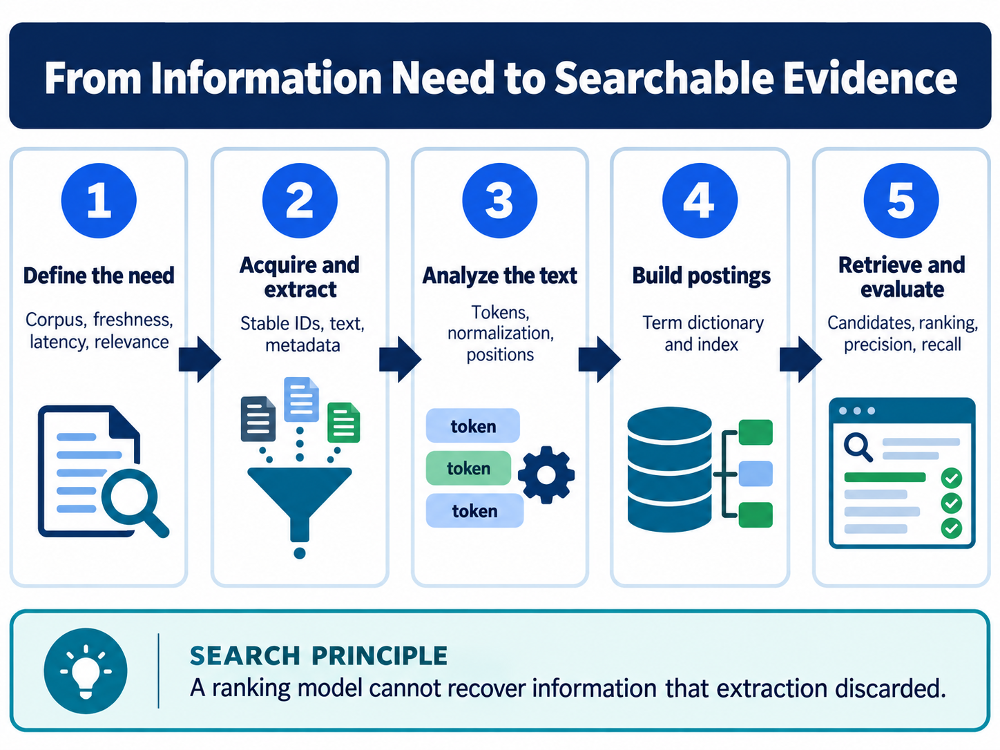

<div class="hero session-hero">
<div class="cell-kicker">CSBD4011P · Chapter 01 lab · CO1</div>
<h1>Search foundations and inverted indexes</h1>
<p>Run the supplied local Python demonstrations for postings, token analysis, transparent BM25 scoring, and precision/recall.</p>
<div class="meta-row"><span class="meta-pill">Local Python</span><span class="meta-pill">JSON data</span><span class="meta-pill">Docker-tested</span></div>
</div>



<figure class="chapter-image-infographic">

<figcaption><strong>Chapter 1 visual guide:</strong> source text becomes analyzed terms, postings, candidates, ranked results, and measurable evaluation.</figcaption>
</figure>

## Alignment and theory link

**Theory chapter:** Available in the [private theory repository](https://github.com/vibhug0077/Big_Data_Search_Security) for enrolled students and instructors.  
**Course outcome:** CO1 — discuss big data search and analyse problems related to Elasticsearch.  
**Lab purpose:** make the retrieval pipeline observable using the exact synthetic examples from the theory chapter.

The theory, code, data, and execution evidence are maintained together in this canonical repository.

## Prerequisites

- Read Chapter 1 in the private theory book.
- Docker Desktop and `docker compose` must be available on the host.
- No host-side Python installation is required; Python 3 runs in `course-dev`.
- The examples use synthetic data and do not contact Elasticsearch, Solr, or Lucene.

## Working directory

Run host commands from:

```text
C:\UPES\Repos\Big_Data_Search_Security_L
```

Inside the container, the public repository is mounted at:

```text
/workspace
```

The lab working directory inside the container is `/workspace/labs/chapter_01_search_foundations`.

## Data files

| Role | File | Used by |
|---|---|---|
| Supplied teaching data | [`data/search_foundations_data.json`](data/search_foundations_data.json) | All four local examples |
| Runnable code | [`code/search_foundations.py`](code/search_foundations.py) | All four local examples |
| Captured output | [`outputs/search_foundations_output.txt`](outputs/search_foundations_output.txt) | Learner comparison |
| Full terminal capture | [`outputs/search_foundations_terminal.txt`](outputs/search_foundations_terminal.txt) | Reproducibility evidence |

The JSON file contains the exact document strings, analysis samples, BM25 corpus, query terms, retrieved IDs, and relevance labels used by the supplied Chapter 1 examples. No new corpus has been substituted.

## Code examples

The single script exposes four clearly labelled examples:

1. Build a positional inverted index and compare AND with phrase matching.
2. Inspect token normalization before indexing.
3. Compute a transparent BM25 teaching score.
4. Compute precision and recall from an explicit relevance set.

## Execution command

PowerShell from the public code root:

```powershell
docker compose -f docker/course-dev/docker-compose.yml run --rm course-dev `
  bash -lc "cd /workspace/labs/chapter_01_search_foundations && python3 code/search_foundations.py"
```

Bash from the public code root:

```bash
docker compose -f docker/course-dev/docker-compose.yml run --rm course-dev \
  bash -lc 'cd /workspace/labs/chapter_01_search_foundations && python3 code/search_foundations.py'
```

## Captured output

<div class="execution-status"><strong>Execution status: Docker-tested.</strong> The script was executed in the `course-dev` container using the supplied JSON data file.</div>



The complete captures are linked above. Students should run the command themselves and submit their own terminal output.

## Interpretation

- AND returns documents containing both query terms; phrase matching additionally requires adjacency and order.
- Token analysis makes the terms received by an index visible; it is an instructional regular expression, not a production language analyzer.
- BM25 combines term frequency, inverse document frequency, and document-length normalization; its score is not a probability.
- Precision and recall depend on an explicit relevance set and its denominator.

## Limitations

- The corpus is deliberately small and synthetic.
- The Python BM25 function is a transparent teaching oracle, not an exact replacement for Lucene’s scorer.
- No real Elasticsearch, Solr, or Lucene service is contacted by this lab.
- The analysis sample containing `CAFÉ` preserves the supplied source encoding snapshot.

## Troubleshooting

| Symptom | Check first | Safe response |
|---|---|---|
| `docker compose` is not recognised | Docker Desktop and the current directory | Start Docker Desktop and run from the public code root. |
| Data file is not found | `/workspace/labs/chapter_01_search_foundations` | Use the exact `cd` in the command; do not run from the theory root inside the container. |
| Output differs | Data file and Python version | Confirm the JSON file was not edited and compare the complete output capture. |

## Viva prompts

1. Why does phrase matching return fewer documents than AND matching?
2. Which information is lost if positions are not stored in postings?
3. Why can a BM25 score not be compared as a probability across unrelated queries?

## Bloom’s taxonomy assessment questions

| Bloom level | Marks | Question | CO |
|---|---:|---|---|
| Understand | 5 | Define corpus, document, token, term, and posting. Trace the query `data security` through analysis and a positional postings list. | CO1 |
| Apply | 5 | Using the supplied four-document data file, calculate the AND result, phrase result, precision, and recall for the first example. Show the denominators. | CO1 |
| Analyse | 5 | Compare the token lists for `Data-Security`, `C++`, and `CAFÉ records`. Identify one case in which the teaching analyzer may be unsuitable. | CO1 |
| Analyse/Evaluate | 15 | For the supplied corpus, explain how AND retrieval, phrase retrieval, and BM25 ranking produce different evidence. Include postings, candidate sets, ranking inputs, and two limitations. | CO1 |
| Evaluate | 15 | Evaluate the supplied analyzer and relevance-judgment design for a university search portal. Recommend field-specific tests for identifiers, prose, punctuation, and accented text. | CO1 |
| Create | 20 | Design a reproducible search-evaluation experiment for a larger teaching corpus. Specify the data schema, analysis policy, index evidence, relevance-judgment process, precision/recall reporting, and failure controls. | CO1 |
