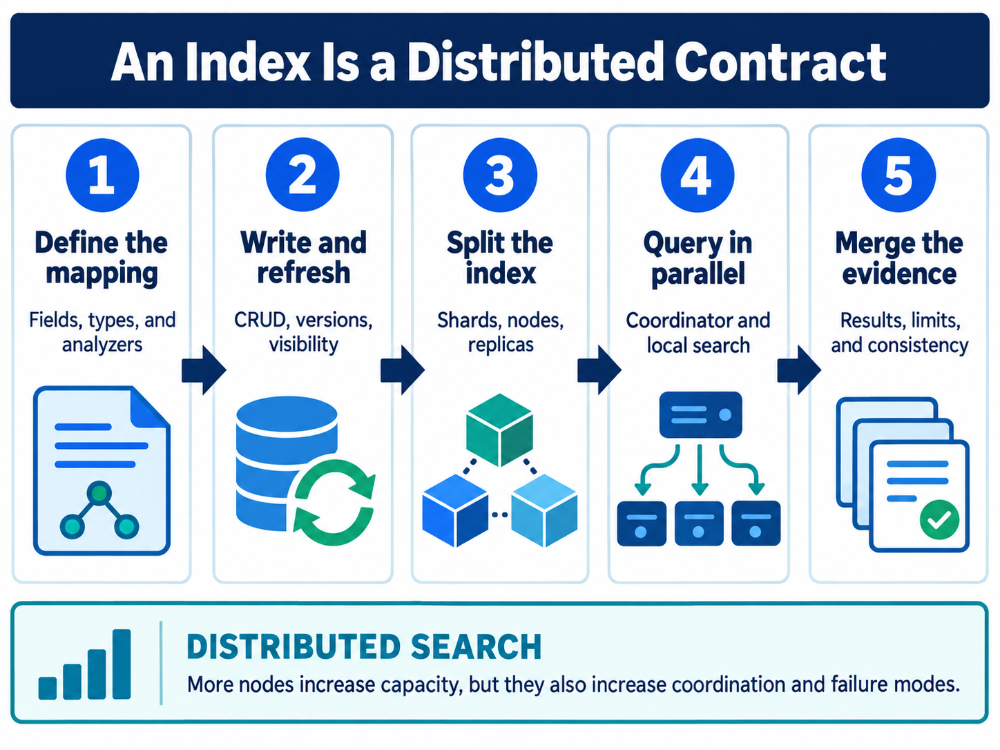

<div class="hero session-hero">
<div class="cell-kicker">CSBD4011P - Chapter 03 lab - CO1</div>
<h1>Elasticsearch data model</h1>
<p>Load the supplied product documents into a real single-node Elasticsearch container, refresh the index, and verify count, match, and phrase queries.</p>
<div class="meta-row"><span class="meta-pill">Elasticsearch 8.18.0</span><span class="meta-pill">JSON NDJSON</span><span class="meta-pill">Docker-tested</span></div>
</div>



<figure class="chapter-image-infographic">

<figcaption><strong>Chapter 3 visual guide:</strong> documents are accepted by a mapped index, assigned to primary shards, made visible by refresh, and searched through the distributed request path.</figcaption>
</figure>

## Alignment and theory link

**Theory chapter:** Available in the [private theory repository](https://github.com/vibhug0077/Big_Data_Search_Security) for enrolled students and instructors.  
**Course outcome:** CO1 - discuss big data search and analyse problems related to Elasticsearch.  
**Lab purpose:** connect the data-model concepts to a real Elasticsearch HTTP service using only the supplied product file.

The theory, code, data, and execution evidence are maintained together in this canonical repository.

## Prerequisites

- Read Chapter 3 in the theory book.
- Docker Desktop and `docker compose` must be available.
- Run from the public code root shown in the execution context.
- The lab uses a single-node, unauthenticated teaching service. Do not reuse these settings for production.

## Working directory and files

Host working directory:

```text
C:\UPES\Repos\Big_Data_Search_Security_L
```

Container working directory:

```text
/workspace/labs/chapter_03_elasticsearch_data_model
```

| Role | File | Used by |
|---|---|---|
| Supplied product records | [`data/products.json`](data/products.json) | Bulk request; five product documents |
| Chapter runner | [`code/elasticsearch_data_model_smoke.py`](code/elasticsearch_data_model_smoke.py) | Selects the chapter data file and calls the supplied smoke implementation |
| Supplied HTTP implementation | [`../../scripts/smoke_test_elasticsearch.py`](../../scripts/smoke_test_elasticsearch.py) | Creates, loads, refreshes, searches, counts, and deletes a disposable index |
| Captured result | [`outputs/elasticsearch_output.txt`](outputs/elasticsearch_output.txt) | Readable result snapshot |
| Raw terminal evidence | [`outputs/elasticsearch_terminal.txt`](outputs/elasticsearch_terminal.txt) | Command, service startup, and result |

## Data model and execution flow

The supplied compose file starts Elasticsearch 8.18.0 as a single node with security disabled for local teaching. The smoke implementation performs this sequence:

1. Check cluster health and record the status.
2. Create the disposable `workbook_products_smoke` index.
3. The course container reaches the published service through Docker Desktop's `host.docker.internal:9200` endpoint.
4. Bulk-load the supplied JSON-lines file.
5. Call `_refresh` so the newly indexed documents are visible to search.
6. Count documents and run `match` and `match_phrase` queries on the mapped product data.
7. Delete the disposable index in cleanup.

The index is the named collection; mappings describe how fields are interpreted; a document is the JSON record; a primary shard owns a partition; a replica is a copy; and the coordinating node merges shard responses. This single-node example reports `yellow` when replicas cannot be assigned. That is expected for this teaching configuration and is not an availability guarantee.

## Execution command

PowerShell from the public code root:

```powershell
docker compose -f docker/elasticsearch/docker-compose.yml up -d
docker compose -f docker/course-dev/docker-compose.yml run --rm course-dev `
  bash -lc "cd /workspace/labs/chapter_03_elasticsearch_data_model && python3 code/elasticsearch_data_model_smoke.py"
docker compose -f docker/elasticsearch/docker-compose.yml down
```

Bash from the public code root:

```bash
docker compose -f docker/elasticsearch/docker-compose.yml up -d
docker compose -f docker/course-dev/docker-compose.yml run --rm course-dev \
  bash -lc 'cd /workspace/labs/chapter_03_elasticsearch_data_model && python3 code/elasticsearch_data_model_smoke.py'
docker compose -f docker/elasticsearch/docker-compose.yml down
```

## Captured output

<div class="execution-status"><strong>Execution status: real Elasticsearch container tested.</strong> The saved capture includes the command and the successful count and query checks. The disposable index is removed by the runner.</div>



## Interpretation

- A successful bulk response does not by itself prove search visibility; the explicit refresh makes the visibility boundary observable.
- The count of five verifies that all supplied product records reached the disposable index.
- `match` uses analyzed text behavior, while `match_phrase` requires the terms to occur as a phrase in the expected order.
- A yellow single-node status means the cluster is usable for this local smoke test but replica allocation is not satisfied.
- The real service performs shard routing and request coordination; the Python examples in the theory chapter are explanatory models, not replacements for this service.

## Limitations

- The compose file disables Elasticsearch security and runs one node for teaching only.
- The supplied data is a five-document product sample, not a performance benchmark.
- The smoke test checks basic ingestion and retrieval, not failure recovery, authentication, or production sizing.
- The disposable index is intentionally deleted after the check; no generated index is published.

## Troubleshooting

| Symptom | Check first | Safe response |
|---|---|---|
| Connection refused | `docker compose -f docker/elasticsearch/docker-compose.yml ps` | Wait for the health check, then rerun the chapter command. |
| Count is not five | `data/products.json` and the bulk response | Restore the supplied file and rerun; do not edit the expected count. |
| Status is yellow | Single-node compose configuration | This is expected when replicas cannot be assigned; green is not required by this teaching smoke test. |
| Docker mount path error | Public root and Docker Desktop file sharing | Run the command from the exact public code root. |

## Viva prompts

1. Why is refresh required before this test searches the newly loaded documents?
2. What is the difference between a primary shard and a replica?
3. Why is a yellow status acceptable here but not evidence of a highly available deployment?
4. Which field behavior would change if a product name were mapped as `keyword` instead of analyzed `text`?

## Bloom's taxonomy assessment questions

| Bloom level | Marks | Question | CO |
|---|---:|---|---|
| Understand | 5 | Define an index, document, mapping, primary shard, replica, and refresh. Explain the role of each in the supplied smoke test. | CO1 |
| Apply | 5 | Using the supplied product file, write the sequence of requests needed to create the disposable index, bulk-load five records, refresh it, and verify the count. | CO1 |
| Analyse | 5 | Analyse why a single-node cluster can return yellow health while the match and phrase queries still succeed. | CO1 |
| Analyse/Evaluate | 15 | Trace one supplied product from JSON input through bulk ingestion, shard routing, refresh, query matching, and response coordination. Identify two points where an operational failure could occur. | CO1 |
| Evaluate | 15 | Evaluate the teaching mapping and single-node settings for a university search service. Recommend changes for exact filtering, full-text search, durability, replicas, and authentication, with reasons. | CO1 |
| Create | 20 | Design a versioned index-and-alias migration for changing one product field from an unsuitable type to an intentional type. Specify mappings, reindex validation, refresh policy, shard/replica choices, rollback evidence, and security checks. | CO1 |
