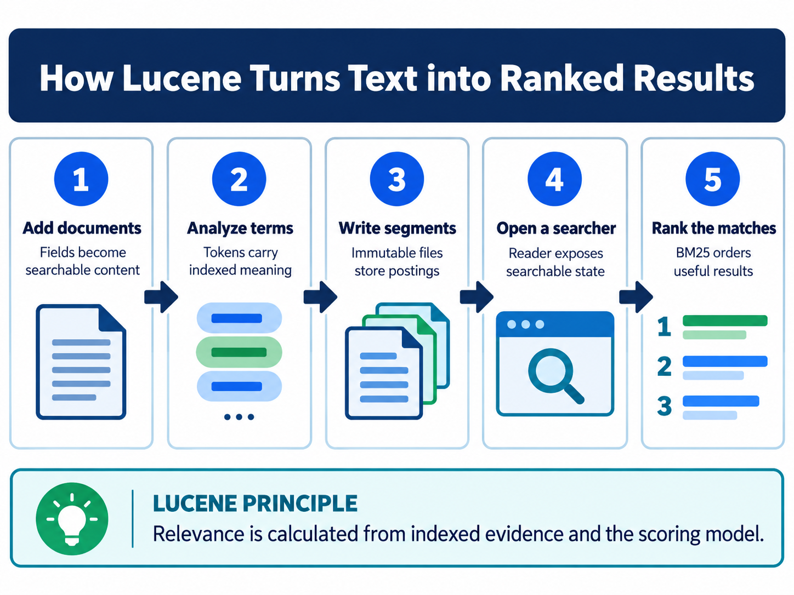

<div class="hero session-hero">
<div class="cell-kicker">CSBD4011P - Chapter 04 lab - CO1</div>
<h1>Lucene architecture and ranking</h1>
<p>Build and run the supplied Java Lucene project in the course container, then observe writers, readers, stored fields, indexed fields, matching, and ranking output.</p>
<div class="meta-row"><span class="meta-pill">Java 17</span><span class="meta-pill">Lucene 9.12.0</span><span class="meta-pill">Maven</span><span class="meta-pill">Docker-tested</span></div>
</div>



<figure class="chapter-image-infographic">

<figcaption><strong>Chapter 4 visual guide:</strong> analyzed fields are written into index structures, readers expose a consistent view, and a searcher returns ranked matches.</figcaption>
</figure>

## Alignment and theory link

**Theory chapter:** Available in the [private theory repository](https://github.com/vibhug0077/Big_Data_Search_Security) for enrolled students and instructors.  
**Course outcome:** CO1 - discuss big data search and analyse problems related to Elasticsearch.  
**Lab purpose:** make the writer-reader-searcher path and the supplied Lucene scores observable in a reproducible Maven run.

The theory, code, data, and execution evidence are maintained together in this canonical repository.

## Prerequisites

- Read Chapter 4 in the theory book.
- Docker Desktop and `docker compose` must be available.
- No host Java or Maven installation is required; the `course-dev` image provides Java 17 and Maven.
- The examples use the supplied Java sources and supplied text files only.

## Working directory and files

Host working directory:

```text
C:\UPES\Repos\Big_Data_Search_Security_L
```

Container working directory:

```text
/workspace/labs/chapter_04_lucene_and_ranking
```

| Role | File | Used by |
|---|---|---|
| Supplied text input | [`data/file_1.txt`](data/file_1.txt) | Local-file indexer teaching input |
| Supplied text input | [`data/file_2.txt`](data/file_2.txt) | Local-file indexer teaching input |
| Supplied text input | [`data/file_3.txt`](data/file_3.txt) | Local-file indexer teaching input |
| Supplied Java source | [`../../java/lucene/src/main/java/org/example/SimpleLuceneExample.java`](../../java/lucene/src/main/java/org/example/SimpleLuceneExample.java) | In-memory indexing and ranked search |
| Supplied Java source | [`../../java/lucene/src/main/java/org/example/fileSearch/LocalFileIndexer.java`](../../java/lucene/src/main/java/org/example/fileSearch/LocalFileIndexer.java) | File indexing and term search |
| Maven build | [`../../java/lucene/pom.xml`](../../java/lucene/pom.xml) | Java 17, Lucene 9.12.0 |
| Chapter runner | [`code/run_examples.sh`](code/run_examples.sh) | Runs both supplied Java programs and cleans the generated index |
| Captured simple result | [`outputs/lucene_simple_output.txt`](outputs/lucene_simple_output.txt) | In-memory Lucene comparison |
| Captured file result | [`outputs/lucene_file_indexer_output.txt`](outputs/lucene_file_indexer_output.txt) | Local-file indexer comparison |
| Raw terminal evidence | [`outputs/lucene_terminal.txt`](outputs/lucene_terminal.txt) | Maven and Java output |

The three files under `data/` are copies of the canonical supplied files under `java/lucene/src/main/resources/text_files/`. The Java program uses the canonical project resources so that the original example remains unchanged; the chapter copies make the learner-facing inputs visible beside the lab guide.

## Architecture and execution flow

The simple program creates an in-memory `ByteBuffersDirectory`, analyzes and writes four documents with `IndexWriter`, closes the writer, opens a `DirectoryReader`, and searches through an `IndexSearcher`. `content` is indexed and `title` is stored for display. The query parser creates a query for `Java`; the output reports total hits and the top two ranked titles.

The local-file program uses `FSDirectory`, reads the supplied `.txt` files, stores `path` and `content`, indexes both fields, and searches for `genetic`. The generated directory at `java/lucene/src/main/resources/index/` is an execution artifact only and is removed by the chapter runner. Maven `target/` and `cp.txt` are also generated build artifacts and are ignored by the repository.

The writer creates index segments; a reader exposes a searchable view; a searcher executes the query; stored fields support result display; indexed fields support matching. Lucene's ranking score is a model-dependent relevance score, not a probability. The supplied simple example demonstrates real Lucene scoring; the Python BM25 code in the theory chapter is a transparent teaching formula rather than a byte-for-byte scorer clone.

## Execution command

PowerShell from the public code root:

```powershell
docker compose -f docker/course-dev/docker-compose.yml run --rm course-dev `
  bash -lc "cd /workspace/labs/chapter_04_lucene_and_ranking && bash code/run_examples.sh"
```

Bash from the public code root:

```bash
docker compose -f docker/course-dev/docker-compose.yml run --rm course-dev \
  bash -lc 'cd /workspace/labs/chapter_04_lucene_and_ranking && bash code/run_examples.sh'
```

## Captured output

<div class="execution-status"><strong>Execution status: real Java Lucene project tested.</strong> The capture records Maven build success, the in-memory search, the file indexer, and the cleanup markers.</div>



## Interpretation

- The simple program reports three total hits because three supplied documents contain the analyzed term `Java`; only the requested top two are printed.
- Scores order matching documents for this query and collection. They should not be interpreted as percentages or compared across unrelated indexes without a fixed evaluation design.
- `title` is stored so it can be displayed in the result; `content` is indexed and searched, and in the supplied example is also stored.
- The file indexer demonstrates a filesystem-backed index, while the simple example demonstrates an in-memory directory.
- The reader is opened after the writer is closed, making the visibility boundary explicit for this small program.

## Limitations

- The example is a small Java demonstration, not a benchmark or production index lifecycle.
- The file indexer uses a local filesystem directory and does not demonstrate replication, authorization, or secure deletion.
- Lucene scores depend on analyzer, field norms, collection statistics, query rewriting, and similarity configuration.
- Generated index and Maven build directories are intentionally excluded from publication.

## Troubleshooting

| Symptom | Check first | Safe response |
|---|---|---|
| Maven cannot resolve dependencies | Docker network and `pom.xml` | Rerun the container command; do not replace the supplied Lucene version. |
| `target` or `cp.txt` appears | This is normal local build output | Leave it ignored; it is not a publication artifact. |
| Generated `index/` remains | The chapter runner cleanup | Remove only `java/lucene/src/main/resources/index/`, then rerun the validator. |
| File count differs | The three supplied text files | Confirm the canonical resources were not edited. |

## Viva prompts

1. Why must a reader be opened after the writer is closed in the simple example?
2. What is the difference between a stored field and an indexed field?
3. Why does the program print two titles when total hits is three?
4. Which factors can change a Lucene score without changing the query text?

## Bloom's taxonomy assessment questions

| Bloom level | Marks | Question | CO |
|---|---:|---|---|
| Understand | 5 | Define analyzer, document, field, term, segment, writer, reader, and searcher in the supplied Java flow. | CO1 |
| Apply | 5 | Trace the query `Java` through the supplied simple program and identify the output fields that are stored, indexed, and searched. | CO1 |
| Analyse | 5 | Analyse why the file indexer returns two hits for `genetic` even though three files are listed before the search output. | CO1 |
| Analyse/Evaluate | 15 | Compare the in-memory and filesystem-backed examples with respect to directory, writer lifecycle, reader visibility, stored fields, indexed fields, and reproducibility. | CO1 |
| Evaluate | 15 | Evaluate whether the printed Lucene score is sufficient to claim that one document is more relevant for a university search portal. Specify the evidence and judged metrics required. | CO1 |
| Create | 20 | Design a Lucene relevance experiment using the supplied files and an expanded corpus. Specify analyzer, field schema, writer/reader lifecycle, query set, relevance judgments, score capture, ranking metrics, and controls for reproducibility. | CO1 |
