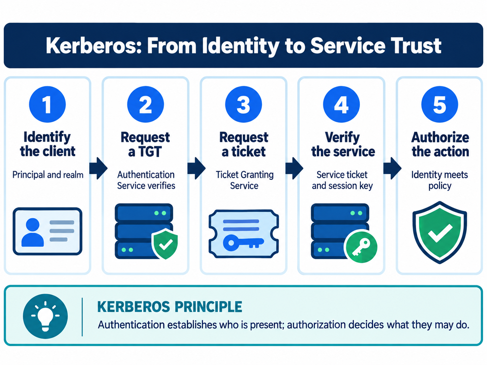

<div class="hero session-hero">
<div class="cell-kicker">CSBD4011P - Chapter 07 lab - CO1</div>
<h1>Kerberos identities, tickets, and trust</h1>
<p>Run the safe local metadata simulations, then inspect the preserved KDC, Kafka, and platform setup files without confusing them with a real Kerberos deployment.</p>
<div class="meta-row"><span class="meta-pill">Local Python simulation</span><span class="meta-pill">Deterministic JSON</span><span class="meta-pill">KDC required for protocol tests</span></div>
</div>



<figure class="chapter-image-infographic">

<figcaption><strong>Chapter 7 visual guide:</strong> Kerberos authentication establishes protocol evidence for a named service; application authorization remains a separate decision.</figcaption>
</figure>

## Alignment and theory link

**Theory chapter:** Available in the [private theory repository](https://github.com/vibhug0077/Big_Data_Search_Security) for enrolled students and instructors.  
**Course outcome:** CO1 - discuss big data search and analyse problems related to Elasticsearch.  
**Lab purpose:** distinguish executable metadata reasoning from protocol claims that require a real KDC, principals, service keys, clocks, and credentials.

The theory, code, data, and execution evidence are maintained together in this canonical repository.

## Prerequisites

- Read Chapter 7 in the theory book.
- Docker Desktop and `docker compose` must be available.
- No password, keytab, ticket cache, KDC, Kafka broker, or secured Hadoop service is included in the lab.
- The Python result is a simulation. It does not authenticate a principal or verify cryptographic ticket material.

## Working directory and files

Host working directory:

```text
C:\UPES\Repos\Big_Data_Search_Security_L
```

Container working directory:

```text
/workspace/labs/chapter_07_kerberos
```

| Role | File | Status |
|---|---|---|
| Deterministic simulation data | [`data/kerberos_simulation_data.json`](data/kerberos_simulation_data.json) | Used by the executable simulation |
| Runnable simulation | [`code/kerberos_simulation.py`](code/kerberos_simulation.py) | Docker-tested |
| Kerberos setup notes | [`platform/kerberos_setup.source.txt`](platform/kerberos_setup.source.txt) | Platform-dependent; preserved, not executed |
| macOS setup notes | [`platform/kerberos_setup_mac.source.txt`](platform/kerberos_setup_mac.source.txt) | Platform-dependent; preserved, not executed |
| Windows setup notes | [`platform/kerberos_setup_windows.source.txt`](platform/kerberos_setup_windows.source.txt) | Platform-dependent; preserved, not executed |
| Kafka producer source | [`platform/KafkaProducerSecurity.source.py`](platform/KafkaProducerSecurity.source.py) | Requires Kafka, Kerberos, principal, and keytab |
| Kafka consumer source | [`platform/KafkaConsumerSecurity.source.py`](platform/KafkaConsumerSecurity.source.py) | Requires Kafka, Kerberos, principal, and keytab |
| Readable output | [`outputs/kerberos_output.txt`](outputs/kerberos_output.txt) | Simulation result only |
| Raw terminal capture | [`outputs/kerberos_terminal.txt`](outputs/kerberos_terminal.txt) | Docker command and simulation output |

## Executable simulation

**Theory chapter:** Available in the [private theory repository](https://github.com/vibhug0077/Big_Data_Search_Security) for enrolled students and instructors.  

1. Service binding and ticket validity metadata.
2. Clock-skew window reasoning.
3. Separation of service authentication from application authorization.
4. Directional cross-realm trust as an allow-list.

The dictionary can be edited by a learner, so these checks do not provide authentication security. They make the reasoning visible before a real KDC is introduced.

## Platform-dependent setup boundary

The preserved setup files document `kinit`, `klist`, `kvno`, `kdestroy`, realm configuration, Windows/macOS installation, and Kafka SASL/Kerberos settings. They require external infrastructure and are not assigned fabricated output:

- A real Kerberos run requires a reachable KDC, realm, user principal, service principal, correct keytab, DNS, synchronized clocks, and credentials.
- Kafka examples require a running broker and topic plus compatible SASL/GSSAPI configuration.
- Hadoop integration requires a secured Hadoop profile and valid service identities.
- This repository contains no complete Dockerised Kerberos/Kafka/Hadoop security environment for these files.

## Execution command

PowerShell from the public code root:

```powershell
docker compose -f docker/course-dev/docker-compose.yml run --rm course-dev `
  bash -lc "cd /workspace/labs/chapter_07_kerberos && python3 code/kerberos_simulation.py"
```

Bash from the public code root:

```bash
docker compose -f docker/course-dev/docker-compose.yml run --rm course-dev \
  bash -lc 'cd /workspace/labs/chapter_07_kerberos && python3 code/kerberos_simulation.py'
```

## Captured output

<div class="execution-status"><strong>Execution status: simulation Docker-tested; platform setup not executed.</strong> The output below is evidence for the deterministic model only.</div>



## Evidence classification

| Classification | Result | Boundary |
|---|---|---|
| Configured control | Simulation rules for service, time, trust, and local authorization | Dictionary configuration only |
| Tested control | Metadata validity, service binding, local authorization, trust direction | Assertions run in the container |
| Failed control | None in the simulation; invalid service and DELETE cases are expected denials | This is not a KDC failure test |
| Untested control | Cryptographic verification, replay, mutual authentication, KDC, keytab, Kafka, Hadoop | No required infrastructure or credentials are present |
| Residual risk | Edited metadata can appear valid; protocol and deployment risks remain | Requires a supervised real-realm test |

## Interpretation and limitations

`Within validity`, `service authentication`, and `search allowed` demonstrate model decisions. They do not prove that Alice owns the principal, that a KDC issued the ticket, that the service can decrypt it, or that replay protection works. `delete allowed: False` demonstrates application authorization is separate from service authentication.

## Viva prompts

1. Why is a TGT not a universal application permission?
2. What evidence is missing from the metadata simulation?
3. Why does a valid service ticket still require application authorization?
4. Which files and credentials are needed before `kinit` can be tested?

## Bloom's taxonomy assessment questions

| Bloom level | Marks | Question | CO |
|---|---:|---|---|
| Understand | 5 | Define principal, realm, KDC, TGT, service ticket, authenticator, and keytab. | CO1 |
| Apply | 5 | Apply the supplied validity-window function to the ticket at times 1200 and 1700 and explain both results. | CO1 |
| Analyse | 5 | Analyse why service authentication can be true while the DELETE authorization decision is false. | CO1 |
| Analyse/Evaluate | 15 | Evaluate the metadata simulation against a real Kerberos exchange. Identify the protocol, cryptographic, replay, deployment, and authorization evidence it lacks. | CO1 |
| Evaluate | 15 | Evaluate the preserved Kafka/Kerberos setup notes. Specify the KDC, principals, keytab, broker, DNS, clock, and credential evidence required before claiming successful integration. | CO1 |
| Create | 20 | Design a supervised Kerberos test plan for a Hadoop/search service. Include realm setup, principal lifecycle, keytab protection, AS/TGS/AP evidence, clock/replay checks, authorization mapping, revocation, audit records, cleanup, and rollback. | CO1 |
