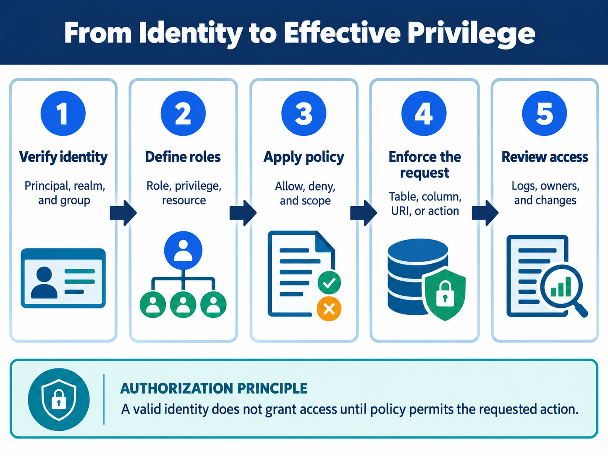

<div class="hero session-hero">
<div class="cell-kicker">CSBD4011P - Chapter 08 lab - CO1</div>
<h1>Sentry and fine-grained authorization</h1>
<p>Run the local RBAC and deny-by-default simulations, then inspect the preserved Sentry/Hive illustration as platform-dependent material requiring a compatible service environment.</p>
<div class="meta-row"><span class="meta-pill">Local Python simulation</span><span class="meta-pill">Deterministic JSON</span><span class="meta-pill">Sentry/Hive required for SQL</span></div>
</div>



<figure class="chapter-image-infographic">

<figcaption><strong>Chapter 8 visual guide:</strong> authentication supplies an identity; authorization expands groups and roles into an effective allow or deny decision at an actual enforcement point.</figcaption>
</figure>

## Alignment and theory link

**Theory chapter:** Available in the [private theory repository](https://github.com/vibhug0077/Big_Data_Search_Security) for enrolled students and instructors.  
**Course outcome:** CO1 - discuss big data search and analyse problems related to Elasticsearch.  
**Lab purpose:** separate executable RBAC reasoning from Sentry syntax and enforcement claims that require a compatible Hadoop ecosystem.

The theory, code, data, and execution evidence are maintained together in this canonical repository.

## Prerequisites

- Read Chapter 8 in the theory book.
- Docker Desktop and `docker compose` must be available.
- No Sentry service, Hive, Impala, Solr, policy store, Kerberos credential, or production dataset is included.
- The Python result is an authorization simulation. It does not authenticate users or prove an integration enforces the policy.

## Working directory and files

Host working directory:

```text
C:\UPES\Repos\Big_Data_Search_Security_L
```

Container working directory:

```text
/workspace/labs/chapter_08_sentry_and_authorization
```

| Role | File | Status |
|---|---|---|
| Deterministic simulation data | [`data/authorization_simulation_data.json`](data/authorization_simulation_data.json) | Used by the executable RBAC simulation |
| Runnable simulation | [`code/authorization_simulation.py`](code/authorization_simulation.py) | Docker-tested |
| Historical Sentry SQL | [`platform/sentry_hive_roles.sql`](platform/sentry_hive_roles.sql) | Platform-dependent; no output fabricated |
| Platform boundary | [`platform/README.md`](platform/README.md) | Required infrastructure and evidence are listed |
| Readable output | [`outputs/authorization_output.txt`](outputs/authorization_output.txt) | Simulation result only |
| Raw terminal capture | [`outputs/authorization_terminal.txt`](outputs/authorization_terminal.txt) | Docker command and simulation output |

## Executable simulation

The script executes the supplied theory examples:

1. Expand users through groups and roles into effective privileges.
2. Test allowed and denied cases, including an unknown service path.
3. Compare effective privileges before and after a local role revocation.

The `unknown` user is denied by default, Bob's reviewer privilege is removed in the snapshot, and the service indexer can insert into staging but cannot select public notes.

## Platform-dependent Sentry boundary

The SQL illustration is historical and requires a compatible Sentry/Hive environment. No output snapshot is provided for it because this repository has no real Sentry/Hive service profile. A genuine test would require:

- compatible Sentry/Hive/Impala/Solr versions and policy store;
- authenticated test principals and group membership;
- a non-sensitive test table and direct-storage test path;
- policy refresh/revocation propagation evidence;
- query, snippet, facet, export, backup, and direct-storage authorization checks; and
- cleanup and audit evidence.

Sentry is retired to the Apache Attic. Treat the SQL as preserved course material, not as a production recommendation.

## Execution command

PowerShell from the public code root:

```powershell
docker compose -f docker/course-dev/docker-compose.yml run --rm course-dev `
  bash -lc "cd /workspace/labs/chapter_08_sentry_and_authorization && python3 code/authorization_simulation.py"
```

Bash from the public code root:

```bash
docker compose -f docker/course-dev/docker-compose.yml run --rm course-dev \
  bash -lc 'cd /workspace/labs/chapter_08_sentry_and_authorization && python3 code/authorization_simulation.py'
```

## Captured output

<div class="execution-status"><strong>Execution status: simulation Docker-tested; Sentry SQL platform-dependent.</strong> The output below is evidence for the deterministic policy model only.</div>



## Evidence classification

| Classification | Result | Boundary |
|---|---|---|
| Configured control | Local group-to-role-to-privilege relation and deny-by-default | Simulation configuration only |
| Tested control | Effective privilege expansion, four policy cases, and local revocation snapshot | Assertions run in the container |
| Failed control | None in the secure simulation; no live enforcement failure was exercised | Absence of a local failure is not integration evidence |
| Untested control | Sentry/Hive/Impala/Solr, cache propagation, direct storage, exports, facets, credentials | No platform service is available |
| Residual risk | Policy store and enforcement point may diverge; hidden paths may disclose data | Requires genuine integration tests |

## Interpretation and limitations

The local simulation proves only that the stated relation produces the stated decisions. It does not prove that a Kerberos identity was verified, that Sentry is installed, that policy reaches a query engine, or that non-query paths are protected. A role name is not an identity proof, and a policy file is not an enforcement result.

## Viva prompts

1. Why is an unknown user denied even when the resource is named `public_notes`?
2. Why can Bob accumulate reader and reviewer privileges?
3. Why is role revocation a propagation test in a distributed system?
4. Which hidden data paths must be tested beyond an interactive query?

## Bloom's taxonomy assessment questions

| Bloom level | Marks | Question | CO |
|---|---:|---|---|
| Understand | 5 | Define authentication, authorization, group, role, privilege, effective access, and deny by default. | CO1 |
| Apply | 5 | Calculate Alice's, Bob's, and the service indexer's effective privileges from the supplied JSON. | CO1 |
| Analyse | 5 | Analyse why Bob loses `restricted_review_queue` after the reviewer role is revoked but retains `public_notes`. | CO1 |
| Analyse/Evaluate | 15 | Evaluate the four local policy cases and identify what each proves about the simulation and what it does not prove about Sentry enforcement. | CO1 |
| Evaluate | 15 | Evaluate the historical Sentry SQL for a real deployment. Identify integration, authentication, propagation, direct-storage, export, facet, audit, and lifecycle evidence required before claiming protection. | CO1 |
| Create | 20 | Design an end-to-end authorization test plan for a Hadoop/search service. Include principal verification, group and role review, least privilege, deny cases, revocation propagation, hidden paths, audit events, rollback, and residual-risk approval. | CO1 |
