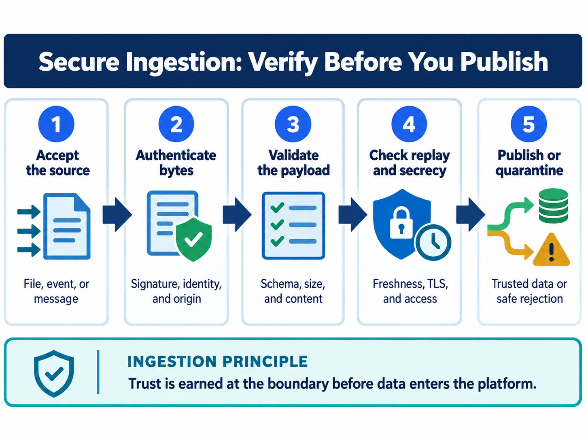

<div class="hero session-hero">
<div class="cell-kicker">CSBD4011P - Chapter 09 lab - CO1</div>
<h1>Integrity and secure ingestion</h1>
<p>Authenticate a synthetic ingest event with HMAC, compare trusted and attacker-controlled digests, reject replayed IDs, and validate an envelope before publication.</p>
<div class="meta-row"><span class="meta-pill">Local Python</span><span class="meta-pill">Synthetic JSON payload</span><span class="meta-pill">Ephemeral key</span><span class="meta-pill">Docker-tested</span></div>
</div>



<figure class="chapter-image-infographic">

<figcaption><strong>Chapter 9 visual guide:</strong> bound and validate input, authenticate canonical bytes, reject replay, quarantine safely, and publish only after the checks pass.</figcaption>
</figure>

## Alignment and theory link

**Theory chapter:** Available in the [private theory repository](https://github.com/vibhug0077/Big_Data_Search_Security) for enrolled students and instructors.  
**Course outcome:** CO1 - discuss big data search and analyse problems related to Elasticsearch.  
**Lab purpose:** execute safe local integrity and ingestion checks while keeping secret generation, key handling, and production boundaries explicit.

The theory, code, data, and execution evidence are maintained together in this canonical repository.

## Prerequisites

- Read Chapter 9 in the theory book.
- Docker Desktop and `docker compose` must be available.
- The HMAC key is generated at runtime, never printed, and never stored in the repository.
- The SQLite replay table is in-memory for teaching; it is not a distributed transaction log.

## Working directory and files

Host working directory:

```text
C:\UPES\Repos\Big_Data_Search_Security_L
```

Container working directory:

```text
/workspace/labs/chapter_09_secure_ingestion
```

| Role | File | Status |
|---|---|---|
| Synthetic payload and envelope | [`data/ingestion_data.json`](data/ingestion_data.json) | Committed teaching data; no secret fields |
| Runnable code | [`code/secure_ingestion_examples.py`](code/secure_ingestion_examples.py) | Docker-tested |
| Readable output | [`outputs/secure_ingestion_output.txt`](outputs/secure_ingestion_output.txt) | Tested result snapshot |
| Raw terminal capture | [`outputs/secure_ingestion_terminal.txt`](outputs/secure_ingestion_terminal.txt) | Docker command and output |

## Code examples

1. Canonicalize the JSON event and reject a changed department with the original HMAC.
2. Demonstrate the difference between a trusted digest and an attacker-controlled replacement digest.
3. Reject a duplicate event ID with a local SQLite primary key.
4. Reject a payload whose `count` is a string instead of an integer.

The HMAC key is synthetic and ephemeral. No credential, digest secret, private key, or token is committed. The output intentionally reports decisions rather than secret bytes.

## Execution command

PowerShell from the public code root:

```powershell
docker compose -f docker/course-dev/docker-compose.yml run --rm course-dev `
  bash -lc "cd /workspace/labs/chapter_09_secure_ingestion && python3 code/secure_ingestion_examples.py"
```

Bash from the public code root:

```bash
docker compose -f docker/course-dev/docker-compose.yml run --rm course-dev \
  bash -lc 'cd /workspace/labs/chapter_09_secure_ingestion && python3 code/secure_ingestion_examples.py'
```

## Captured output

<div class="execution-status"><strong>Execution status: Docker-tested.</strong> The script used the committed synthetic JSON and generated its HMAC key only inside the temporary container process.</div>



## Evidence classification

| Classification | Result | Boundary |
|---|---|---|
| Configured control | Canonical HMAC, trusted digest comparison, replay table, and schema checks | Local program configuration only |
| Tested control | Tamper rejection, duplicate rejection, digest comparison, and schema validation | Assertions and output captured in the container |
| Failed control | None; negative tamper/replay/schema cases were rejected as expected | This is not a key-distribution or production-ingestion test |
| Untested control | Secret distribution, durable cross-process replay, time window, quarantine access, and transport | Requires deployment-specific evidence |
| Residual risk | Authenticated payloads can still be factually wrong; ephemeral key handling is not a KMS | Business validation and operational controls remain required |

## Interpretation and limitations

HMAC authenticates the canonical bytes for holders of the shared secret, but it does not prove that the count is true or prevent replay on its own. The trusted-digest example only works when the expected digest comes from a trusted manifest. The SQLite primary key demonstrates a local duplicate decision, not a durable distributed ingest transaction.

## Viva prompts

1. Why does changing JSON content invalidate the original HMAC?
2. Why is a changed file plus a changed untrusted digest not evidence of integrity?
3. What failure can occur between inserting the replay record and publishing the document?
4. Why should size and schema checks happen before expensive parsing or publication?

## Bloom's taxonomy assessment questions

| Bloom level | Marks | Question | CO |
|---|---:|---|---|
| Understand | 5 | Distinguish a digest, HMAC, replay record, envelope, canonical bytes, quarantine, and publication decision. | CO1 |
| Apply | 5 | Apply the supplied HMAC flow to the changed department and explain why the original tag is rejected. | CO1 |
| Analyse | 5 | Analyse why the trusted-manifest and attacker-controlled-digest results differ. | CO1 |
| Analyse/Evaluate | 15 | Evaluate the order of receive, bound, parse, authenticate, validate, deduplicate, quarantine, and publish operations. Identify two unsafe reorderings. | CO1 |
| Evaluate | 15 | Evaluate the local replay table for a distributed ingestion service. Discuss crash consistency, concurrency, retention, idempotency scope, and evidence needed before production use. | CO1 |
| Create | 20 | Design a secure ingestion envelope and acceptance test suite for classified search documents. Include canonicalization, authentication, schema/business checks, replay handling, quarantine, provenance, secret management, safe logs, and recovery. | CO1 |
