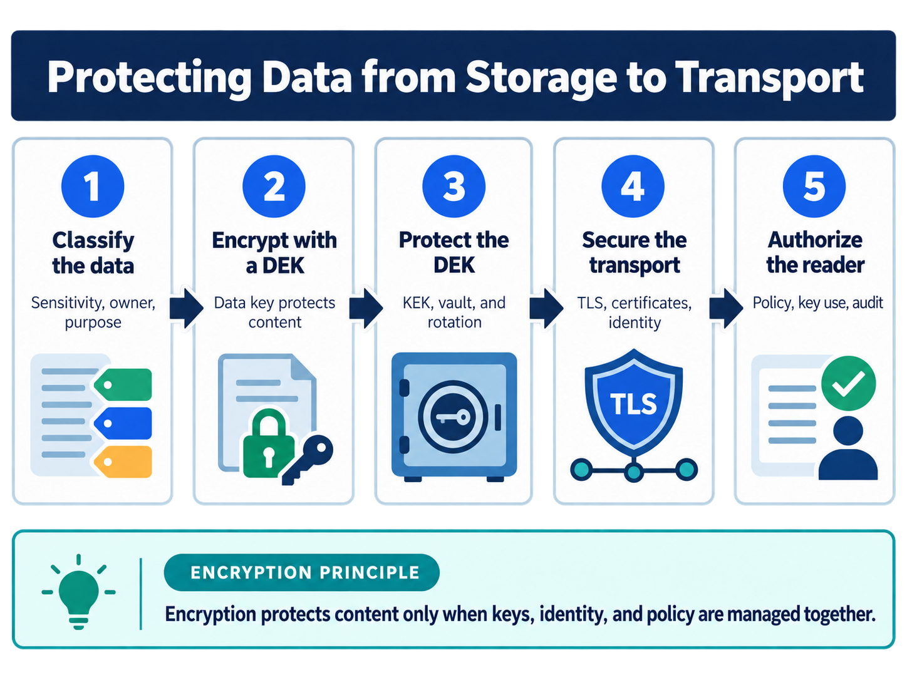

<div class="hero session-hero">
<div class="cell-kicker">CSBD4011P - Chapter 10 lab - CO1</div>
<h1>Encryption and transport</h1>
<p>Test authenticated encryption, envelope encryption, key re-wrapping, certificate-validating TLS context defaults, and a real local TLS handshake using only synthetic runtime keys.</p>
<div class="meta-row"><span class="meta-pill">Python cryptography</span><span class="meta-pill">AES-GCM</span><span class="meta-pill">Loopback TLS</span><span class="meta-pill">Docker-tested</span></div>
</div>



<figure class="chapter-image-infographic">

<figcaption><strong>Chapter 10 visual guide:</strong> protect plaintext and keys at their boundaries, verify peer identity on every TLS hop, and keep encryption separate from authorization.</figcaption>
</figure>

## Alignment and theory link

**Theory chapter:** Available in the [private theory repository](https://github.com/vibhug0077/Big_Data_Search_Security) for enrolled students and instructors.  
**Course outcome:** CO1 - discuss big data search and analyse problems related to Elasticsearch.  
**Lab purpose:** execute safe synthetic AES-GCM, envelope-key, TLS-context, and certificate-validation examples without committing secrets or claiming production KMS/TLS coverage.

The theory, code, data, and execution evidence are maintained together in this canonical repository.

## Prerequisites

- Read Chapter 10 in the theory book.
- Docker Desktop and `docker compose` must be available.
- The container installs the pinned `cryptography==44.0.2` dependency.
- AES keys, DEK/KEK material, TLS private key, and self-signed certificate are generated only in the temporary container process. No key or certificate is committed.

## Working directory and files

Host working directory:

```text
C:\UPES\Repos\Big_Data_Search_Security_L
```

Container working directory:

```text
/workspace/labs/chapter_10_encryption_and_transport
```

| Role | File | Status |
|---|---|---|
| Synthetic plaintext, AAD, key IDs, and hop table | [`data/encryption_transport_data.json`](data/encryption_transport_data.json) | Committed teaching data; no secret material |
| Runnable code | [`code/encryption_transport_examples.py`](code/encryption_transport_examples.py) | Docker-tested |
| Readable output | [`outputs/encryption_transport_output.txt`](outputs/encryption_transport_output.txt) | Tested result snapshot |
| Raw terminal capture | [`outputs/encryption_transport_terminal.txt`](outputs/encryption_transport_terminal.txt) | Docker command and output |

The certificate and private key are deliberately not data files in the repository. They are generated in a temporary directory for the loopback handshake and removed when the script exits.

## Code examples

1. Encrypt synthetic plaintext with AES-GCM and reject changed ciphertext or associated data.
2. Wrap a DEK under a KEK, recover the data, and re-wrap the same DEK under a new KEK identifier.
3. Inspect a certificate-validating TLS client context and perform a real local loopback handshake using an ephemeral self-signed `localhost` certificate.
4. Reject a wrong hostname and review the unprotected fictional search-to-worker hop.

No external server, certificate authority, KMS, HDFS encryption zone, or production credential is contacted.

## Execution command

PowerShell from the public code root:

```powershell
docker compose -f docker/course-dev/docker-compose.yml build course-dev
docker compose -f docker/course-dev/docker-compose.yml run --rm course-dev `
  bash -lc "cd /workspace/labs/chapter_10_encryption_and_transport && python3 code/encryption_transport_examples.py"
```

Bash from the public code root:

```bash
docker compose -f docker/course-dev/docker-compose.yml build course-dev
docker compose -f docker/course-dev/docker-compose.yml run --rm course-dev \
  bash -lc 'cd /workspace/labs/chapter_10_encryption_and_transport && python3 code/encryption_transport_examples.py'
```

## Captured output

<div class="execution-status"><strong>Execution status: Docker-tested.</strong> AES-GCM, envelope operations, and a local certificate-validating TLS handshake were executed in the rebuilt `course-dev` container. Secrets and runtime certificates were not printed or saved.</div>



## Evidence classification

| Classification | Result | Boundary |
|---|---|---|
| Configured control | AES-GCM, DEK/KEK envelope, TLS minimum, hostname validation | Local example configuration; no KMS or external CA |
| Tested control | Round trip, tamper rejection, re-wrap, verified loopback TLS, wrong-host rejection | Assertions and output captured in the container |
| Failed control | Fictional `search -> worker` hop is recorded as `GAP TO REVIEW` | It is a design finding, not a live network failure |
| Untested control | KMS, HDFS zones, external certificate chain, mTLS, production key rotation, every service hop | Requires platform-specific infrastructure |
| Residual risk | Ephemeral key custody and self-signed trust do not establish production security | Operational key management and deployment tests remain required |

## Interpretation and limitations

AES-GCM provides authenticated encryption when key and nonce rules are followed. The envelope example keeps the KEK in process memory and therefore does not test a KMS. The loopback test proves that this local client validates the synthetic certificate and hostname; it does not prove an external certificate chain, server configuration, mutual TLS, or every course-platform hop.

## Viva prompts

1. Why does changing associated data cause AES-GCM decryption to fail?
2. What is the difference between a DEK and a KEK?
3. Why does a successful localhost TLS handshake not prove external certificate trust?
4. Which hop is recorded as a transport gap, and what evidence would close it?

## Bloom's taxonomy assessment questions

| Bloom level | Marks | Question | CO |
|---|---:|---|---|
| Understand | 5 | Define authenticated encryption, nonce, associated data, DEK, KEK, certificate validation, hostname checking, and TLS hop. | CO1 |
| Apply | 5 | Apply the AES-GCM example to the changed ciphertext and changed metadata cases. State the expected result and reason. | CO1 |
| Analyse | 5 | Analyse why re-wrapping a DEK can rotate KEK protection without re-encrypting the bulk plaintext. | CO1 |
| Analyse/Evaluate | 15 | Evaluate the local TLS handshake evidence. Distinguish certificate-chain validation, hostname verification, protocol negotiation, mutual authentication, and application authorization. | CO1 |
| Evaluate | 15 | Evaluate the envelope-encryption design for a search platform. Identify KMS, key-version, recovery, export, plaintext, audit, and derived-index risks. | CO1 |
| Create | 20 | Design an end-to-end encryption and transport acceptance plan for a distributed search system. Include data classification, AES-GCM/nonces, DEK/KEK lifecycle, KMS boundaries, certificate identities, every hop, mTLS decisions, rotation, failure evidence, recovery, and secrets scanning. | CO1 |
