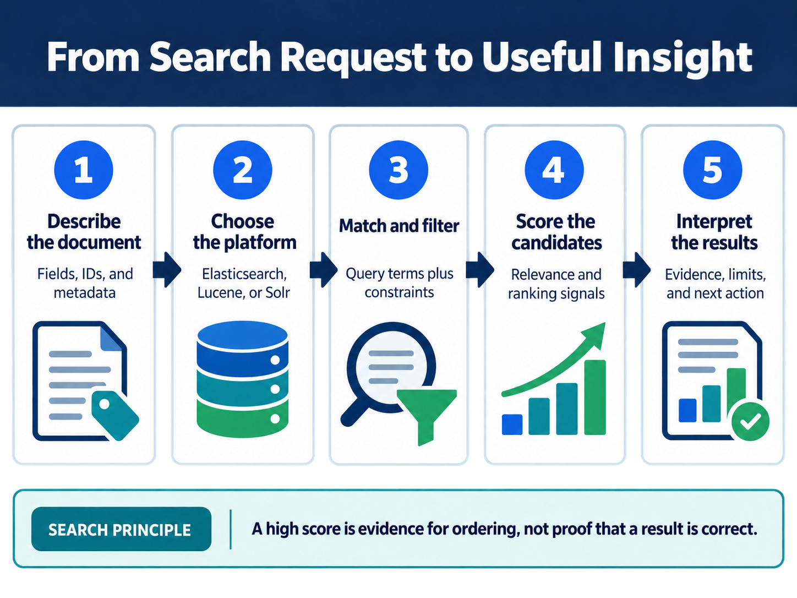

<div class="hero session-hero">
<div class="cell-kicker">CSBD4011P · Workbook 00</div>
<h1>Environment and execution flow</h1>
<p>Understand the container boundary before running a platform example.</p>
<div class="meta-row"><span class="meta-pill">Prerequisite: Docker Desktop</span><span class="meta-pill">Evidence: service status</span></div>
</div>



<div class="working-directory">
<strong>Working directory</strong>
<code>C:\UPES\Repos\Big_Data_Search_Security_L</code>
<small>Run the commands below from this repository root. After cloning, substitute your local &lt;repo-root&gt; path.</small>
</div>

<figure class="chapter-image-infographic">

<figcaption><strong>Execution flow:</strong> describe the data, choose the real platform, run the search, and interpret evidence.</figcaption>
</figure>

## Alignment, objective, and prerequisites

**Purpose:** establish one repeatable execution path for the practical workbooks. **Outcome:** the learner can identify the host requirement, the service container, the supplied data file, the command, and the output evidence. Docker Desktop with Docker Compose is required on the host; Java, Maven, and Python for the Lucene and security examples are installed in `docker/course-dev`.

## Procedure

1. Open a PowerShell or Bash terminal at the repository root.
2. Verify Docker and Compose.
3. Read the selected workbook before starting a service.
4. Inspect its listed input/data files.
5. Run the service-specific command and compare the result with the saved output snapshot.

PowerShell:

```powershell
docker version
docker compose version
```

Bash:

```bash
docker version
docker compose version
```

<div class="question-before-code"><strong>Question before code</strong></div>

Which parts of the experiment run on the host, and which parts run inside the container?

## Service choice

| Practical need | Compose file | Supplied data or source |
|---|---|---|
| HDFS and Hadoop Streaming | `docker/hadoop/docker-compose.yml` | `workbooks/01_hdfs_mapreduce/data.txt`, mapper, reducer |
| Java Lucene | `docker/course-dev/docker-compose.yml` | `java/lucene/` and its `text_files/` |
| Elasticsearch Query DSL | `docker/elasticsearch/docker-compose.yml` | `workbooks/03_elasticsearch/products.json` |
| Security examples | `docker/course-dev/docker-compose.yml` | `workbooks/04_security_basics/*.source.py` |

## Evidence and interpretation

The learner should retain the command, exit status, relevant service status, input file name, and output snapshot. A page that shows a command is not proof that a platform ran. Each subsequent workbook contains the tested output captured from the Dockerised example.

## Troubleshooting

If Docker is unavailable, stop at environment validation and record the failure as a prerequisite issue. Do not replace the real Hadoop, Lucene, or Elasticsearch execution with a local imitation and report it as platform evidence.
