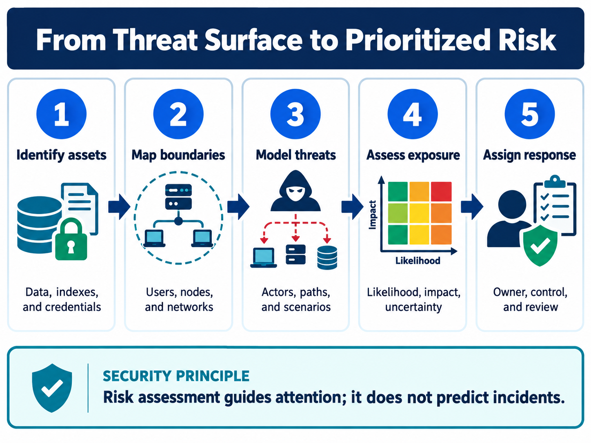
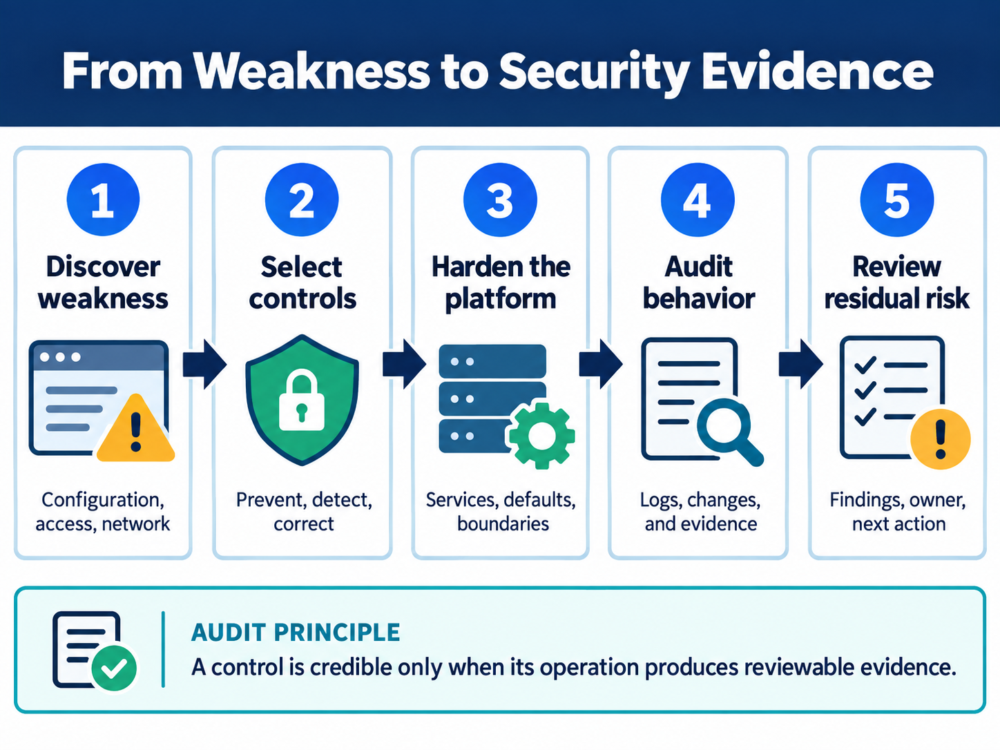

<div class="hero session-hero">
<div class="cell-kicker">CSBD4011P · Workbook 04 · Security examples</div>
<h1>Integrity and access-control evidence</h1>
<p>Run the supplied tampering and role-based-access examples in the course container and inspect the recorded security evidence.</p>
<div class="meta-row"><span class="meta-pill">Input: source-embedded samples</span><span class="meta-pill">Evidence: rejected tampering</span><span class="meta-pill">Evidence: denied access</span></div>
</div>



<div class="working-directory">
<strong>Working directory</strong>
<code>C:\UPES\Repos\Big_Data_Search_Security_L</code>
<small>Run the host command from this repository root. The Python examples execute inside the <code>course-dev</code> container and write temporary logs under <code>/tmp</code>.</small>
</div>

<figure class="chapter-image-infographic">

<figcaption><strong>Security reasoning:</strong> identify assets and boundaries before modelling threats and assigning a response.</figcaption>
</figure>

## Alignment, objective, and prerequisites

**Official practical blocks:** data tampering, role-based access, Kafka security, and Kerberos setup notes. **Outcome:** distinguish integrity verification from authorization and identify what an execution result does and does not prove. The dependency-free Python examples are tested in `docker/course-dev`; Kafka and Kerberos remain source snapshots until their required services and credentials are supplied.

## Source examples and data boundary

| Example | Source file | Data used |
|---|---|---|
| Hash-based tampering check | [`tampering_example.source.py`](tampering_example.source.py) | transaction string embedded in the supplied source |
| Role-based access | [`RoleBasedAccess.source.py`](RoleBasedAccess.source.py) | `admin`/`guest` roles and users embedded in the supplied source |
| Security smoke check | [`scripts/smoke_test_security.py`](../../scripts/smoke_test_security.py) | syntax-checks all five supplied Python source files |
| Kafka configuration | [`KafkaProducerSecurity.source.py`](KafkaProducerSecurity.source.py), [`KafkaConsumerSecurity.source.py`](KafkaConsumerSecurity.source.py) | environment placeholders; not live-tested |
| Kerberos setup | [`kerberos_setup.source.txt`](kerberos_setup.source.txt), Windows and macOS notes | platform configuration instructions; not live-tested |

The examples contain their own small teaching data. The access log is generated in the container's temporary directory during testing and is not committed as an input dataset.

<div class="execution-status"><strong>Execution status: Docker-tested.</strong> The supplied Python security files were syntax-checked, and the tampering and unauthorized-access assertions passed.</div>

<div class="code-example-heading">Code examples: supplied integrity and role-based-access programs</div>

## Procedure

Syntax-check all supplied Python security files and run the tested examples:

```powershell
python scripts/smoke_test_security.py
```

Run the source programs individually when teaching the mechanism:

```powershell
docker compose -f docker/course-dev/docker-compose.yml run --rm course-dev bash -c "cd /tmp && python3 /workspace/workbooks/04_security_basics/tampering_example.source.py"
docker compose -f docker/course-dev/docker-compose.yml run --rm course-dev bash -c "cd /tmp && python3 /workspace/workbooks/04_security_basics/RoleBasedAccess.source.py"
```

<div class="question-before-code"><strong>Question before code</strong></div>

If the stored hash is available beside the data, what exactly does the tampering example establish? Does it establish who is authorized to read the data?

<div class="recorded-output-heading">Recorded output from the security code examples</div>

## Recorded output: tampering check

The supplied example first verifies the original data and then rejects the modified transaction string. The saved output is [`outputs/tampering_example.txt`](outputs/tampering_example.txt).



## Recorded output: role-based access

The supplied example allows `john` through the configured role and rejects `sam`, while writing an unauthorized-access record. The saved output is [`outputs/role_based_access.txt`](outputs/role_based_access.txt).

The role-based result is included in the same output panel above and the complete raw execution is stored in [`outputs/role_based_access.txt`](outputs/role_based_access.txt).

## Publication smoke result

The repository-level check also confirms that the five Python source examples compile and that both tampering and unauthorized-access assertions are present in the runtime output. The saved summary is [`outputs/security_smoke_test.txt`](outputs/security_smoke_test.txt).

The complete smoke-test summary is stored in [`outputs/security_smoke_test.txt`](outputs/security_smoke_test.txt), with the raw terminal capture in [`outputs/security_terminal.txt`](outputs/security_terminal.txt).

<figure class="chapter-image-infographic">

<figcaption><strong>Evidence principle:</strong> a control is credible only when its operation produces reviewable evidence.</figcaption>
</figure>

## Interpretation and boundary

`After Tampering : False` is evidence that the changed string no longer matches the stored hash in this toy example. It is not a production signature scheme. `Unauthorized access` is evidence that the supplied role check rejected the guest user. It is not evidence of Kerberos, Kafka, or a distributed authorization service.

## Troubleshooting and viva

Explain integrity, authentication, authorization, and audit as separate controls. Explain why a reference hash must be protected from the attacker and why logging an access denial is useful evidence but does not itself prevent access.
